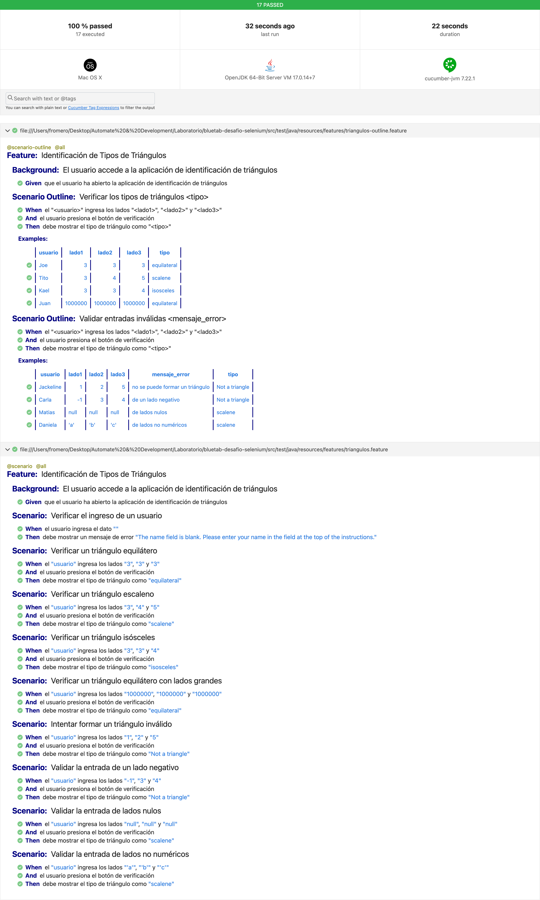

# Proyecto de Pruebas Automatizadas para Identificación de Tipos de Triángulos
Este proyecto automatiza la prueba de una aplicación web que identifica el tipo de triángulo basado en las longitudes de sus lados. La aplicación está disponible en la ruta: https://www.developsense.com/triangle/triangle.html .

## Tecnologías Utilizadas
- Lenguaje: `Java`
- Tipo de Proyecto: `Gradle`
- Framework de Ejecución: `JUnit 5`
- Framework de Pruebas: `Selenium`
- Driver o Navegador: `Chrome`, `Edge`, `Firefox`, `Safari`, `IE`
- Arquetipo: `Page Object Model (POM)`
- Especificación de Casos de Prueba: `Cucumber 7`
- Ejecución: `Jenkins` y `GitHub Actions`

## Requisitos Previos de Casos Automatizados
1. **Java Development Kit (JDK)**: Asegúrate de tener instalado JDK 11 o superior.
   - Verifica la instalación con: `java -version`
2. **Gradle**: Necesario para gestionar las dependencias y construir el proyecto.
   - Verifica la instalación con: `gradle -v`
3. **Dependencias**: Tener configuradas las dependencias necesarias en el archivo `build.gradle`, incluyendo Cucumber, JUnit, y Selenium.
4. **Navegador**: Tener el navegador Chrome instalado y disponible para ejecutar las pruebas.

## Casos de Prueba para Identificación de Tipos de Triángulos
### Automatizables
| ID     | DESCRIPCIÓN                                         | PRECONDICIONES                                                       | PASOS                                                                                                             | RESULTADO ESPERADO           | CLASIFICACIÓN       | AUTOMATIZABLE |
| ------ | --------------------------------------------------- | -------------------------------------------------------------------- | ----------------------------------------------------------------------------------------------------------------- | ---------------------------- | ------------------- | ------------- |
| TC_001 | Verificar un triángulo equilátero                   | El usuario ha abierto la aplicación de identificación de triángulos. | 1. Ingresar "3", "3", "3" en los campos de los lados.<br>2. Presionar el botón de verificación.                   | Se muestra "equilateral".    | Equilátero          | Sí            |
| TC_002 | Verificar un triángulo escaleno                     | El usuario ha abierto la aplicación de identificación de triángulos. | 1. Ingresar "3", "4", "5" en los campos de los lados.<br>2. Presionar el botón de verificación.                   | Se muestra "scalene".        | Escaleno            | Sí            |
| TC_003 | Verificar un triángulo isósceles                    | El usuario ha abierto la aplicación de identificación de triángulos. | 1. Ingresar "3", "3", "4" en los campos de los lados.<br>2. Presionar el botón de verificación.                   | Se muestra "isosceles".      | Isósceles           | Sí            |
| TC_004 | Verificar un triángulo equilátero con lados grandes | El usuario ha abierto la aplicación de identificación de triángulos. | 1. Ingresar "1000000", "1000000", "1000000" en los campos de los lados.<br>2. Presionar el botón de verificación. | Se muestra "equilateral".    | Equilátero          | Sí            |
| TC_005 | Intentar formar un triángulo inválido               | El usuario ha abierto la aplicación de identificación de triángulos. | 1. Ingresar "1", "2", "5" en los campos de los lados.<br>2. Presionar el botón de verificación.                   | Se muestra "Not a triangle". | No Triángulo        | Sí            |
| TC_006 | Validar la entrada de un lado negativo              | El usuario ha abierto la aplicación de identificación de triángulos. | 1. Ingresar "-1", "3", "4" en los campos de los lados.<br>2. Presionar el botón de verificación.                  | Se muestra "Not a triangle". | Entrada Inválida    | Sí            |
| TC_007 | Validar la entrada de lados nulos                   | El usuario ha abierto la aplicación de identificación de triángulos. | 1. Ingresar "", "", "" en los campos de los lados.<br>2. Presionar el botón de verificación.                      | Se muestra "scalene".        | Entrada Nula        | Sí            |
| TC_008 | Validar la entrada de lados no numéricos            | El usuario ha abierto la aplicación de identificación de triángulos. | 1. Ingresar "a", "b", "c" en los campos de los lados.<br>2. Presionar el botón de verificación.                   | Se muestra "scalene".        | Entrada No Numérica | Sí            |

### No Automatizables
| ID     | DESCRIPCIÓN                                 | PRECONDICIONES                                                                      | PASOS                                                                                                              | RESULTADO ESPERADO                                                                                      | AUTOMATIZABLE |
| ------ | ------------------------------------------- | ----------------------------------------------------------------------------------- | ------------------------------------------------------------------------------------------------------------------ | ------------------------------------------------------------------------------------------------------- | ------------- |
| TC_009 | Validación gráfica del dibujo del triángulo | Requiere una inspección visual para verificar el dibujo del triángulo.              | 1. Ingresar valores válidos que formen un triángulo.<br>2. Observar el dibujo del triángulo dentro del rectángulo. | El triángulo debe dibujarse correctamente dentro del rectángulo, ajustándose a su tamaño.               | No            |
| TC_010 | Usabilidad de la interfaz de usuario        | Requiere una evaluación manual de la experiencia del usuario.                       | Navegar por la interfaz y realizar operaciones básicas.                                                            | La interfaz debe ser fácil de usar y los mensajes de error deben ser claros y útiles.                   | No            |
| TC_011 | Rendimiento bajo carga pesada               | Requiere la simulación de múltiples operaciones en rápida sucesión.                 | Realizar múltiples operaciones de identificación de triángulos en rápida sucesión.                                 | El tiempo de respuesta debe ser razonablemente rápido y consistente.                                    | No            |
| TC_012 | Seguridad contra XSS                        | Requiere la simulación de intentos de inyección de scripts maliciosos.              | Intentar ingresar scripts maliciosos en los campos de entrada.                                                     | La aplicación debe bloquear o escapar cualquier contenido malicioso sin permitir que se ejecute.        | No            |
| TC_013 | Accesibilidad para lectores de pantalla     | Requiere la simulación de intentos de inyección de scripts maliciosos.              | Utilizar un lector de pantalla para navegar por la aplicación.                                                     | El contenido debe ser completamente accesible y comprensible para los usuarios de lectores de pantalla. | No            |
| TC_014 | Integración entre frontend y backend        | Requiere la simulación de la interacción entre la interfaz de usuario y el backend. | Simular la interacción entre la interfaz de usuario y el backend para verificar la comunicación.                   | La comunicación debe ser exitosa y los resultados deben coincidir con lo esperado.                      | No            |

## Mejoras de Funcionalidad
- Añadir validación para asegurarse de que los números ingresados sean positivos y mayores que cero.
- Añadir validación para evitar entradas demasiado grandes que puedan causar problemas de desempeño.
- Mejorar los mensajes de error para que sean más específicos y útiles para el usuario. Por ejemplo, "Por favor, ingrese números positivos mayores que cero."
- Asegurarse de que el triángulo se dibuje de manera consistente y clara dentro del rectángulo.
- Añadir una opción para cambiar el color del triángulo o del fondo para mejorar la legibilidad.
- Optimizar los cálculos para determinar el tipo de triángulo para mejorar el rendimiento, especialmente en entradas muy grandes.
- Añadir etiquetas de accesibilidad a los elementos HTML para facilitar la navegación con lectores de pantalla.

## Estructura del Proyecto
La estructura del proyecto es la siguiente:
```
dir/
├── .gitignore
├── README.md
├── build.gradle
├── settings.gradle
├── src/
│   ├── main/
│   │   └── java/
│   └── test/
│       └── java/
│           ├── core/
│           │   ├── locators/
│           │   │   └── ExampleLocator.java  # Localizadores de elementos en las páginas
│           │   ├── pages/
│           │   │   └── ExamplePage.java     # Representación de una página web
│           │   ├── steps/
│           │   │   └── ExampleStep.java     # Definiciones de pasos para Cucumber
│           │   └── utils/
│           │       ├── Action.java          # Métodos comunes para interacciones con Selenium
│           │       ├── Core.java            # Configuración base del framework
│           │       ├── Excel.java           # Manejo de datos desde archivos CSV
│           │       └── Test.java            # Clase principal para ejecutar las pruebas
│           ├── resources/
│           │   ├── features/
│           │       └── Ejemplo.feature      # Archivo de pruebas en formato Gherkin
│           ├── fixtures/
│           │   ├── test.data.csv            # Datos de prueba para el entorno de test
│           │   └── prod.data.csv            # Datos de prueba para el entorno de producción
│           └── config.properties            # Archivo de configuración del entorno
├── build/
│   ├── reports/
│   │   └── cucumber-reports.html            # Reporte HTML generado por las pruebas
```

### Descripción de los directorios principales:
1. **Core**: Contiene clases de utilidad y configuración del framework:
   - `Core.java`: Configuración base del framework.
   - `Action.java`: Métodos comunes para interactuar con Selenium.
   - `Test.java`: Clase principal para ejecutar las pruebas.

2. **Resources**:
   - **Locators**: Clases que contienen los localizadores de elementos (`TrianguloLocator.java`).
   - **Pages**: Clases que representan las páginas o vistas (`TrianguloPage.java`).
   - **Steps**: Definiciones de pasos para Cucumber (`TrianguloStep.java`).
   - **Config**: Archivo `config.properties` para definir configuraciones específicas del entorno.

3. **Features**: Archivos `.feature` escritos en Gherkin que definen los escenarios de prueba.

4. **Build**: Carpeta generada automáticamente que contiene los resultados de las pruebas, incluyendo reportes en HTML (`index.html`).

**Notas:**
1. El archivo `build.gradle` define las dependencias y configuración del proyecto.
2. Los reportes generados por las pruebas están en `build/reports/cucumber-reports.html`.

## Configuración
1. Existen dos configuraciones por ambiente: `test` o `prod`.
2. Edita el archivo de configuración `src/test/resources/config.properties` para definir los valores necesarios, como:
   - `test.baseurl`: URL base para las pruebas.
   - `test.platform`: Navegador a utilizar (`IE`, `Chrome`, `Edge`, `Firefox`, `Safari`).

## Ejecución del Proyecto
1. Para ejecutar las pruebas, utiliza el siguiente comando:
   ```bash
   # Ejecución Total
   gradle test

   # Ejecución por tags
   gradle test -Dcucumber.filter.tags="@all"

   # Ejecución de ambiente
   gradle test -Dcucumber.filter.tags="@all" -Dcucumber.env="test"
   ```
   Esto ejecutará las pruebas definidas en los archivos `.feature` utilizando Cucumber y JUnit5.

2. Para abrir el reporte HTML de las pruebas, verifica los resultados en:
   ```
   build/reports/cucumber-reports.html
   ```
   [Reporte de Ejecución](src/test/java/resources/evidencia/cucumber-reports.html)
   